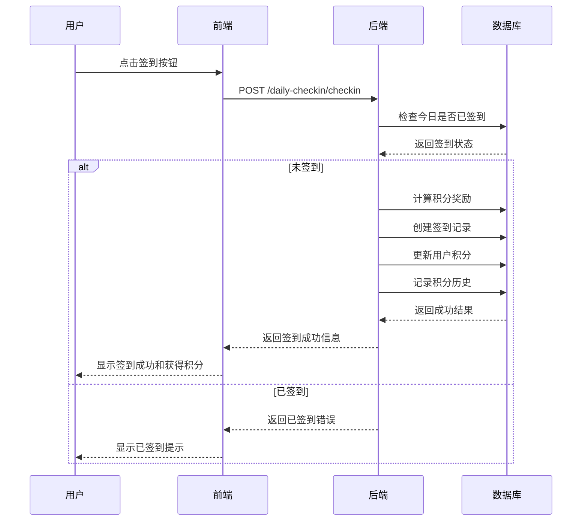
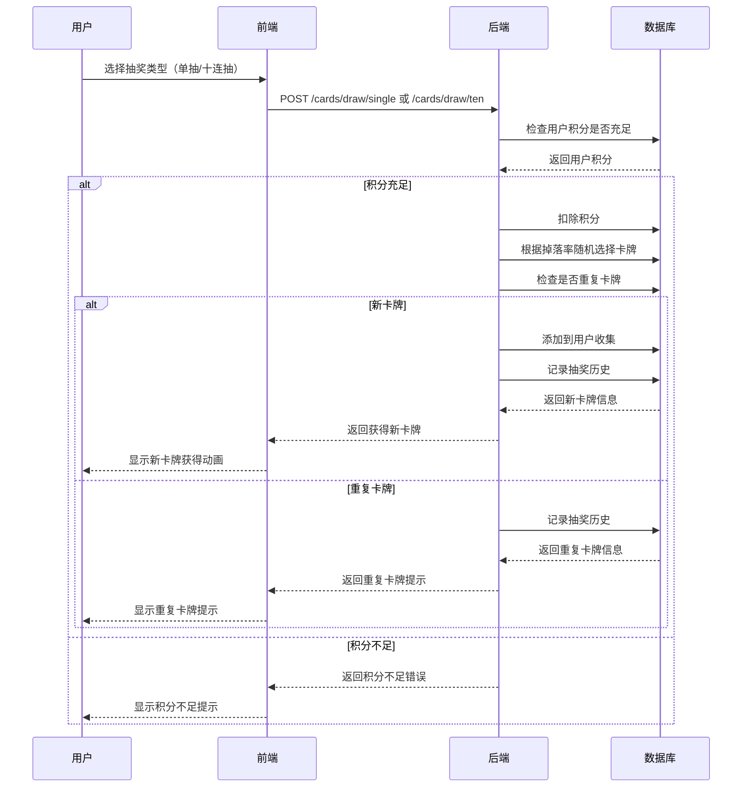

# 每日签到积分系统与卡牌抽奖系统集成文档

## 系统概述

本系统将每日签到积分功能与卡牌抽奖游戏完美结合，为用户提供完整的游戏化学习体验。用户通过每日签到获得积分，使用积分进行卡牌抽奖，收集生物学主题的卡牌。

## 系统架构

```
┌─────────────────┐    ┌─────────────────┐    ┌─────────────────┐
│   前端应用      │    │   后端API       │    │   数据库        │
│                 │    │                 │    │                 │
│ - 签到界面      │◄──►│ - 签到服务      │◄──►│ - 签到记录表    │
│ - 积分显示      │    │ - 积分管理      │    │ - 积分表        │
│ - 卡牌收集      │    │ - 卡牌系统      │    │ - 卡牌定义表    │
│ - 抽奖界面      │    │ - 抽奖逻辑      │    │ - 用户卡牌表    │
└─────────────────┘    └─────────────────┘    └─────────────────┘
```

## 核心功能流程

### 1. 用户签到流程



### 2. 卡牌抽奖流程



## 数据库设计

### 核心表结构

#### 1. 每日签到相关表

**daily_checkins (签到记录表)**
```sql
CREATE TABLE daily_checkins (
    id INTEGER PRIMARY KEY AUTOINCREMENT,
    user_id INTEGER NOT NULL,
    checkin_date DATE NOT NULL,
    checkin_time DATETIME NOT NULL,
    points_earned INTEGER NOT NULL DEFAULT 10,
    streak_days INTEGER NOT NULL DEFAULT 1,
    created_at DATETIME DEFAULT CURRENT_TIMESTAMP,
    UNIQUE(user_id, checkin_date)
);
```

**user_points (用户积分表)**
```sql
CREATE TABLE user_points (
    id INTEGER PRIMARY KEY AUTOINCREMENT,
    user_id INTEGER NOT NULL UNIQUE,
    total_points INTEGER NOT NULL DEFAULT 0,
    points_earned_today INTEGER NOT NULL DEFAULT 0,
    last_checkin_date DATE,
    current_streak INTEGER NOT NULL DEFAULT 0,
    longest_streak INTEGER NOT NULL DEFAULT 0,
    created_at DATETIME DEFAULT CURRENT_TIMESTAMP,
    updated_at DATETIME DEFAULT CURRENT_TIMESTAMP
);
```

**point_history (积分历史表)**
```sql
CREATE TABLE point_history (
    id INTEGER PRIMARY KEY AUTOINCREMENT,
    user_id INTEGER NOT NULL,
    points_change INTEGER NOT NULL,
    change_type TEXT NOT NULL,
    description TEXT,
    created_at DATETIME DEFAULT CURRENT_TIMESTAMP
);
```

#### 2. 卡牌系统相关表

**card_definitions (卡牌定义表)**
```sql
CREATE TABLE card_definitions (
    id INTEGER PRIMARY KEY AUTOINCREMENT,
    card_id TEXT NOT NULL UNIQUE,
    name TEXT NOT NULL,
    description TEXT,
    rarity TEXT NOT NULL,
    image_url TEXT,
    points_cost INTEGER NOT NULL DEFAULT 100,
    drop_rate REAL NOT NULL DEFAULT 0.1,
    created_at DATETIME DEFAULT CURRENT_TIMESTAMP
);
```

**user_cards (用户卡牌收集表)**
```sql
CREATE TABLE user_cards (
    id INTEGER PRIMARY KEY AUTOINCREMENT,
    user_id INTEGER NOT NULL,
    card_id TEXT NOT NULL,
    obtained_at DATETIME DEFAULT CURRENT_TIMESTAMP,
    obtained_method TEXT NOT NULL DEFAULT 'draw',
    UNIQUE(user_id, card_id)
);
```

**draw_history (抽奖历史表)**
```sql
CREATE TABLE draw_history (
    id INTEGER PRIMARY KEY AUTOINCREMENT,
    user_id INTEGER NOT NULL,
    card_id TEXT,
    points_spent INTEGER NOT NULL,
    draw_type TEXT NOT NULL,
    created_at DATETIME DEFAULT CURRENT_TIMESTAMP
);
```

## API接口集成

### 前端集成示例

#### 1. 签到功能集成

```javascript
// 获取签到状态
async function getCheckinStatus() {
    try {
        const response = await fetch('/api/v1/daily-checkin/status', {
            headers: {
                'Authorization': `Bearer ${token}`
            }
        });
        const data = await response.json();
        
        if (data.success) {
            updateCheckinUI(data.data);
        }
    } catch (error) {
        console.error('获取签到状态失败:', error);
    }
}

// 执行签到
async function performCheckin() {
    try {
        const response = await fetch('/api/v1/daily-checkin/checkin', {
            method: 'POST',
            headers: {
                'Authorization': `Bearer ${token}`,
                'Content-Type': 'application/json'
            }
        });
        const data = await response.json();
        
        if (data.success) {
            showCheckinSuccess(data.data);
            updateUserPoints(data.data.user_points);
        } else {
            showError(data.error.message);
        }
    } catch (error) {
        console.error('签到失败:', error);
    }
}
```

#### 2. 卡牌抽奖集成

```javascript
// 获取用户卡牌收集
async function getUserCollection() {
    try {
        const response = await fetch('/api/v1/cards/collection', {
            headers: {
                'Authorization': `Bearer ${token}`
            }
        });
        const data = await response.json();
        
        if (data.success) {
            displayUserCards(data.data.cards);
            updateCollectionStats(data.data.stats);
        }
    } catch (error) {
        console.error('获取卡牌收集失败:', error);
    }
}

// 单抽
async function singleDraw() {
    try {
        const response = await fetch('/api/v1/cards/draw/single', {
            method: 'POST',
            headers: {
                'Authorization': `Bearer ${token}`,
                'Content-Type': 'application/json'
            }
        });
        const data = await response.json();
        
        if (data.success) {
            showDrawResult(data.data);
            updateUserPoints(data.data.remaining_points);
            if (!data.data.is_duplicate) {
                refreshUserCollection();
            }
        } else {
            showError(data.error.message);
        }
    } catch (error) {
        console.error('抽卡失败:', error);
    }
}

// 十连抽
async function tenDraw() {
    try {
        const response = await fetch('/api/v1/cards/draw/ten', {
            method: 'POST',
            headers: {
                'Authorization': `Bearer ${token}`,
                'Content-Type': 'application/json'
            }
        });
        const data = await response.json();
        
        if (data.success) {
            showTenDrawResults(data.data);
            updateUserPoints(data.data.remaining_points);
            refreshUserCollection();
        } else {
            showError(data.error.message);
        }
    } catch (error) {
        console.error('十连抽失败:', error);
    }
}
```

## 积分规则详解

### 积分获取规则

| 条件 | 积分奖励 | 说明 |
|------|----------|------|
| 基础签到 | 10积分 | 每日签到基础奖励 |
| 连续签到 | +2积分/天 | 每天额外奖励，最多20积分 |
| 周末签到 | +5积分 | 周六、周日额外奖励 |
| 月初签到 | +20积分 | 每月1号额外奖励 |

### 积分消耗规则

| 功能 | 消耗积分 | 说明 |
|------|----------|------|
| 单抽 | 100积分 | 单次抽奖 |
| 十连抽 | 900积分 | 十次抽奖（优惠100积分） |

### 积分计算示例

**连续签到7天的积分计算：**
- 第1天：10积分
- 第2天：10 + 2 = 12积分
- 第3天：10 + 4 = 14积分
- 第4天：10 + 6 = 16积分
- 第5天：10 + 8 = 18积分
- 第6天：10 + 10 = 20积分（周末：+5 = 25积分）
- 第7天：10 + 12 = 22积分（周末：+5 = 27积分）

**总积分：10 + 12 + 14 + 16 + 18 + 25 + 27 = 122积分**

## 卡牌系统详解

### 卡牌稀有度分布

| 稀有度 | 掉落率 | 卡牌数量 | 积分价值 |
|--------|--------|----------|----------|
| 普通 | 40% | 5张 | 50积分 |
| 稀有 | 25% | 5张 | 200积分 |
| 史诗 | 15% | 5张 | 500积分 |
| 传说 | 5% | 5张 | 1000积分 |

### 抽奖概率计算

**单次抽奖获得各稀有度卡牌的概率：**
- 普通卡牌：40% × (5/20) = 10%
- 稀有卡牌：25% × (5/20) = 6.25%
- 史诗卡牌：15% × (5/20) = 3.75%
- 传说卡牌：5% × (5/20) = 1.25%

### 收集完成度计算

```
收集完成度 = (用户拥有卡牌数量 / 总卡牌定义数量) × 100%
```

## 系统配置

### 环境变量配置

```bash
# 数据库配置
DATABASE_PATH=./data/biodesk.db

# JWT配置
JWT_SECRET_KEY=your_jwt_secret_key
JWT_ACCESS_TOKEN_EXPIRES=3600

# 积分系统配置
BASE_POINTS=10
STREAK_BONUS=2
MAX_STREAK_BONUS=20
WEEKEND_BONUS=5
MONTH_START_BONUS=20

# 卡牌系统配置
SINGLE_DRAW_COST=100
TEN_DRAW_COST=900
```

### 初始化脚本

```python
# 初始化数据库表
from models.daily_checkin import DailyCheckin
from models.card_system import CardSystem

# 确保表存在
DailyCheckin.ensure_tables()
CardSystem.ensure_tables()

print("数据库表初始化完成")
```

## 性能优化建议

### 1. 数据库优化
- 为常用查询字段添加索引
- 定期清理历史数据
- 使用连接池管理数据库连接

### 2. 缓存策略
- 缓存用户积分信息
- 缓存卡牌定义数据
- 缓存排行榜数据

### 3. 并发处理
- 使用事务确保数据一致性
- 添加乐观锁防止并发问题
- 实现幂等性接口

## 监控和日志

### 关键指标监控
- 每日签到用户数
- 积分消耗统计
- 卡牌抽奖成功率
- 系统响应时间

### 日志记录
- 用户签到日志
- 积分变化日志
- 抽奖操作日志
- 错误异常日志

## 安全考虑

### 1. 数据安全
- 防止积分刷取
- 防止重复签到
- 防止恶意抽奖

### 2. 接口安全
- JWT Token验证
- 权限控制
- 请求频率限制

### 3. 业务安全
- 积分不能为负数
- 每日只能签到一次
- 抽奖需要足够积分

## 扩展功能建议

### 1. 社交功能
- 好友系统
- 卡牌交易
- 排行榜竞争

### 2. 活动系统
- 限时活动
- 特殊奖励
- 节日活动

### 3. 成就系统
- 签到成就
- 收集成就
- 连续成就

## 故障排除

### 常见问题

1. **签到失败**
   - 检查用户是否已签到
   - 检查数据库连接
   - 检查JWT Token有效性

2. **抽奖失败**
   - 检查用户积分是否充足
   - 检查卡牌定义是否存在
   - 检查数据库事务

3. **积分显示错误**
   - 检查积分计算逻辑
   - 检查缓存数据
   - 检查数据库一致性

### 调试工具

```python
# 检查用户积分
def check_user_points(user_id):
    from models.daily_checkin import DailyCheckin
    points = DailyCheckin.get_user_points(user_id)
    print(f"用户 {user_id} 积分信息: {points}")

# 检查用户卡牌
def check_user_cards(user_id):
    from models.card_system import CardSystem
    cards = CardSystem.get_user_cards(user_id)
    print(f"用户 {user_id} 卡牌数量: {len(cards)}")
```

## 总结

本系统通过每日签到积分和卡牌抽奖的有机结合，为用户提供了完整的游戏化学习体验。系统设计考虑了性能、安全、扩展性等多个方面，为后续功能扩展奠定了良好的基础。
